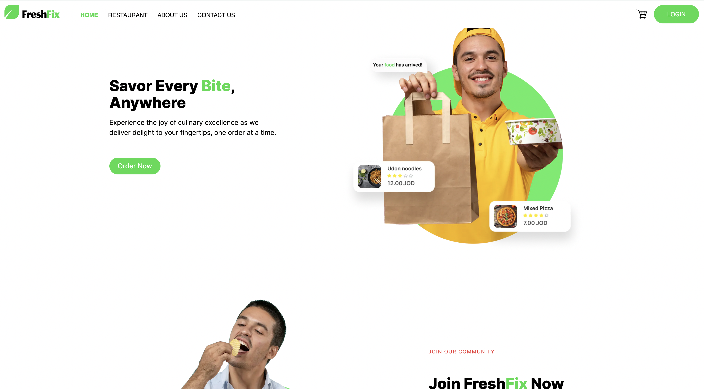
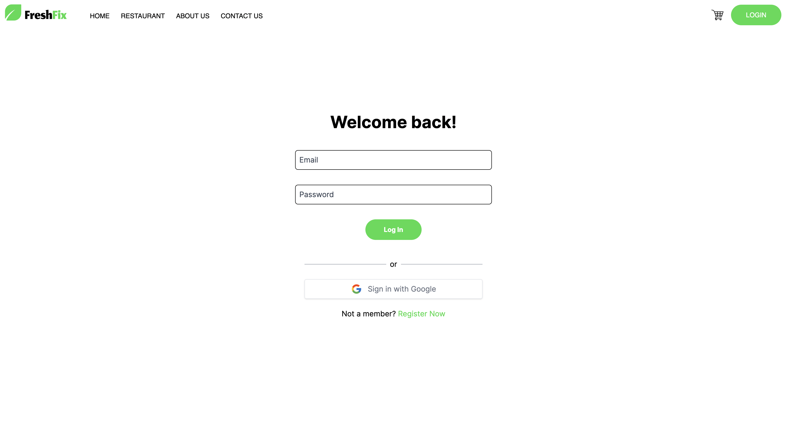
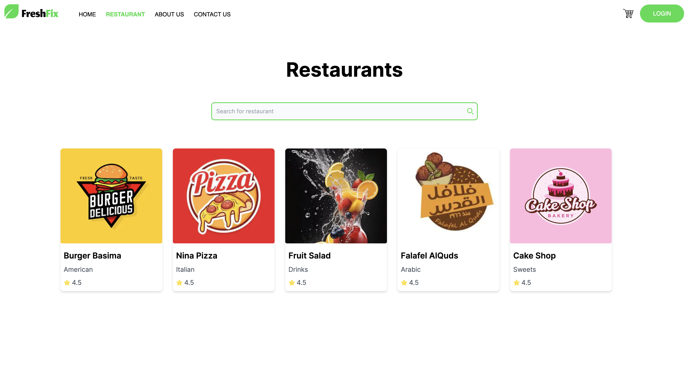
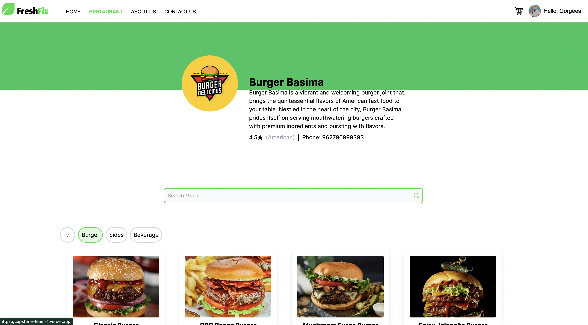
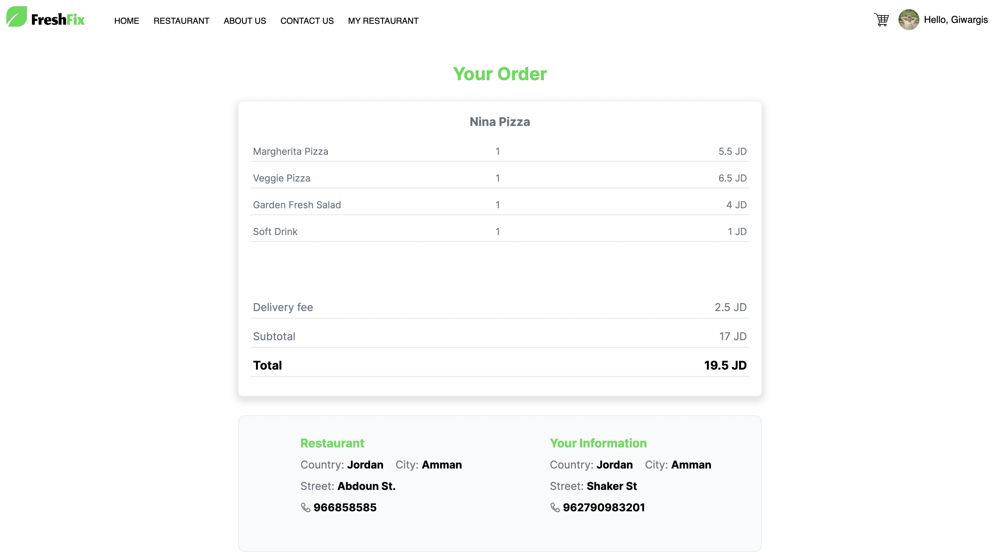
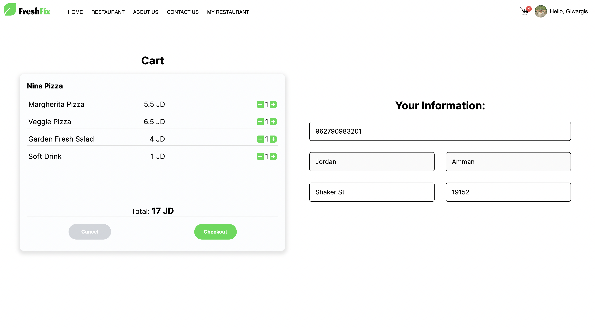
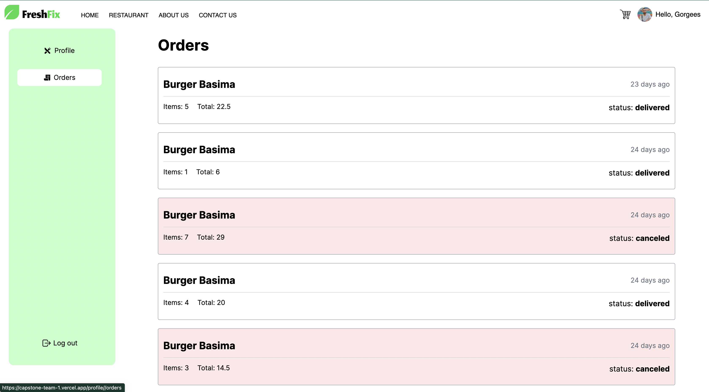
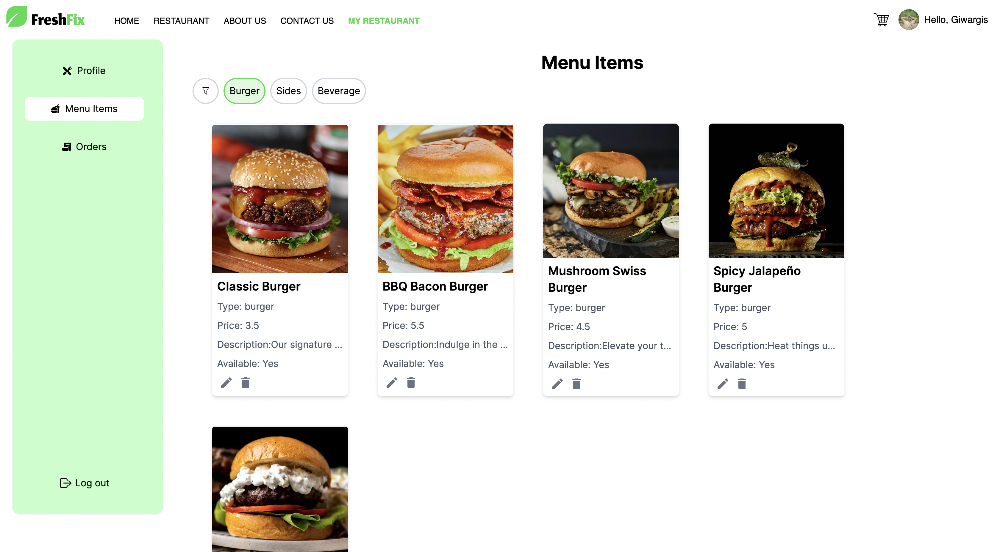

# FreshFix restaurant ordering app (Capstone Full-Stack project)

Our project is a full-stack e-commerce platform designed to streamline the ordering process for both restaurants and customers.Implement using MERN stack with latest technologies and with our solution, restaurants can effortlessly manage their menu, track orders, and maintain customer relationships, while customers enjoy a seamless ordering experience from their favorite restaurant.
 
**[LIVE DEMO](https://capstone-team-1.vercel.app/)**

## Features

- **Backend**: Our backend infrastructure is powered by a Dockerized Express server, meticulously configured to handle cross-origin requests (CORS) seamlessly. It's intricately connected to MongoDB, ensuring robust data persistence and management capabilities.

- **Frontend**: Embracing cutting-edge technologies, our frontend is driven by a Dockerized Next.js application. Leveraging its prowess in server-side rendering and static site generation, we deliver an unparalleled user experience, combining speed, responsiveness, and interactivity.

- **Development Environment**: Our development environment is fully Dockerized, providing a consistent setup for both frontend and backend development. This ensures uniformity across various configurations, facilitating collaboration and reducing deployment hiccups.

## Developers

- **Gorgees Odisho**
- **Hala Qitouqa**
- **Aya Ahmad**
- **Nour Kayyali**

## Tools

### Front-End

- **Next.js**:
  A React framework for building server-side rendered and static web applications.
- **Tailwind CSS**:
  A utility-first CSS framework for rapidly building custom designs.
- **Redux**:
  A predictable state container for managing application state in JavaScript apps.

### Back-End

- **MongoDB**:
  A NoSQL database for storing structured data in JSON-like documents.
- **Express**:
  A fast, unopinionated, minimalist web framework for Node.js.
- **Firebase**:
  A platform for building and running serverless applications. Used here for storing images.
- **Bcrypt**:
  A library for hashing passwords securely before storing them in a database.
- **JWT (JSON Web Tokens)**:
  A compact, URL-safe means of representing claims to be transferred between two parties. Used here for authentication and authorization.
- **Google OAuth**:
  OAuth 2.0 authentication mechanism provided by Google. Used here to implement Google credentials.
- **Passport**:
  An authentication middleware for Node.js that supports authentication via various strategies. Used here to manage Google OAuth.

## Website preview

    
    
    
    
    
    
    
    

## Getting Started

Follow the README.md file in each of the client and server for setup steps
